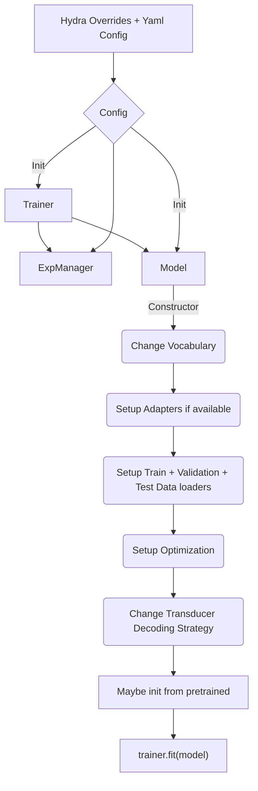

# ASR with Hybrid Transducer/CTC Models

This directory contains example scripts to train ASR models with two decoders of Transducer and CTC Loss. 

Currently supported models are - 

* Character based Hybrid RNNT/CTC model
* Subword based Hybrid RNNT/CTC model

# Model execution overview

The training scripts in this directory execute in the following order. When preparing your own training-from-scratch / fine-tuning scripts, please follow this order for correct training/inference.

During restoration of the model, you may pass the Trainer to the restore_from / from_pretrained call, or set it after the model has been initialized by using `model.set_trainer(Trainer)`.

## GSPO post-training (Hybrid TDT+CTC BPE)

This repo also includes a minimal, memory-first GSPO post-training example for Hybrid TDT+CTC BPE models:

- Script: `examples/asr/asr_hybrid_transducer_ctc/post_train_gspo_tdt_ctc_bpe.py`
- Config: `examples/asr/conf/fastconformer/hybrid_transducer_ctc/fastconformer_hybrid_tdt_ctc_bpe_gspo.yaml`

The implementation is intentionally "slow but small" (freeze encoder + `batch_size=1` + grad accumulation) and uses
n-best beam hypotheses plus sequence-level importance ratios.

Important note (PPO semantics):
- Standard PPO distinguishes `pi_old` (behavior policy that generated samples) from `pi_new` (current policy being optimized).
- This example currently computes `logp_old` and `logp_new` from the same parameters within a single `training_step()`.
  In practice, the importance ratio is ~1 and the update behaves like a sequence-level on-policy policy gradient /
  MWER-style risk minimization objective, wrapped in a PPO-shaped loss.
- The code/config are structured so we can extend toward stricter PPO/GSPO later (PPO epochs / old-policy snapshot / KL).

References:
- PPO (clipped objective): https://arxiv.org/abs/1707.06347
- TDT (Token-and-Duration Transducer): https://arxiv.org/abs/2304.06795
- GSPO discussion: https://arxiv.org/pdf/2507.18071
